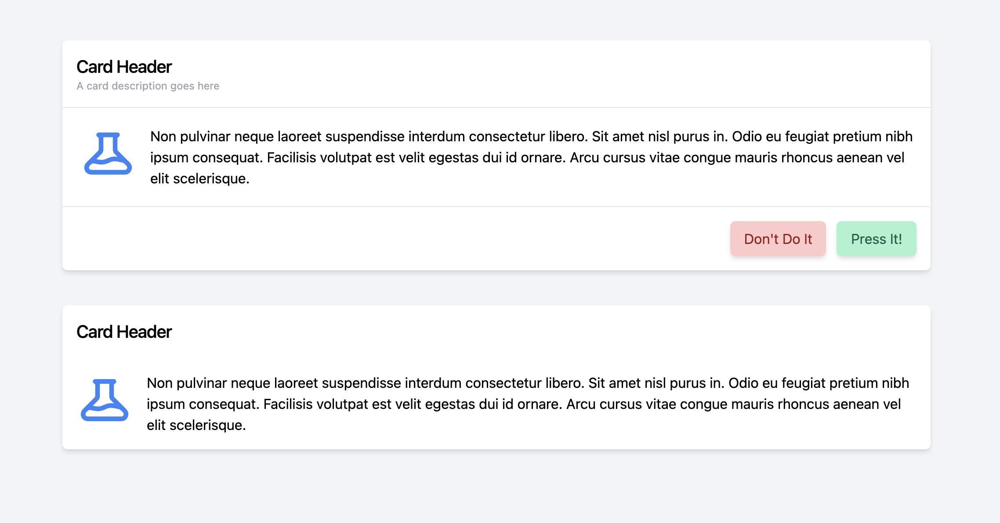

# TailBlazor.Card

Blazor Card a basic yet customizable card component for Tailwindcss

Without passing it anything you'll get very basic styles, however giving it it's base classes and you can really make a customizable list component that Tailwind is capable of.

It has the ability to be a single section or multiple for easy customization.




## Getting Setup

You can install the package via the NuGet package manager just search for TailBlazor.Card. You can also install via powershell using the following command.

`Install-Package TailBlazor.Card`

Or via the dotnet CLI.

`dotnet add package TailBlazor.Card`

### 1. Add Imports

Add line to your \_Imports.razor

```
@using TailBlazor.Card
```

### 2. Create Card Component

Simply open up a component and add your content. 

```
<TailBlazorCard>
    ...
</TailBlazorCard>

```

Alternatively if you want pre-divided sections you can instead pass the card `TailBlazorCardSection` components. Each component unless customized will automatically be padded p-4 and divided with a light gray divider line.

```
<TailBlazorCard>
   <TailBlazorCardSection>
        <h2 class="text-xl font-medium tracking-tight">Card Header</h2>
        <p class="text-gray-400 font-normal text-xs">A card description goes here</p>
    </TailBlazorCardSection>
    <TailBlazorCardSection class="flex p-5 space-x-4">
        <div>
            <TailBlazorHeroIcon Icon=HeroIcon.Beaker Width=64 Height=64 Stroke="text-blue-500" />
        </div>
        <div class="flex-1">
            <p>Non pulvinar neque laoreet suspendisse interdum consectetur libero. Sit amet nisl purus in. Odio eu feugiat pretium nibh ipsum consequat. Facilisis volutpat est velit egestas dui id ornare. Arcu cursus vitae congue mauris rhoncus aenean vel elit scelerisque.</p>
        </div>
    </TailBlazorCardSection>
    <TailBlazorCardSection class="flex justify-end p-4 space-x-3">
        <button class="text-red-800 bg-red-200 hover:bg-red-400 px-4 py-2 shadow-md rounded-md">Don't Do It</button>
        <button class="text-green-800 bg-green-200 hover:bg-green-400 px-4 py-2 shadow-md rounded-md">Press It!</button>
    </TailBlazorCardSection>
</TailBlazorCard>
```

### 3. Adding Styles

`TailBlazorCard` and `TailBlazorCardSection` both can override their class styles by simply setting `class` or `Class` in the component. Keep in mind if you override the default styles you'd either have to replace or choose new styles. This is intentional to not block you from doing what you want.

```
<TailBlazorCardSection class="flex justify-end p-4 space-x-3">
    ...
</TailBlazorCardSection>
```